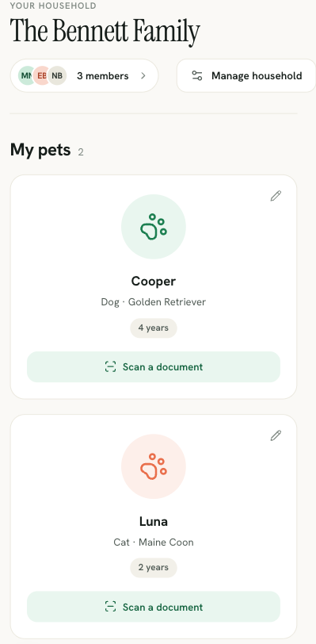
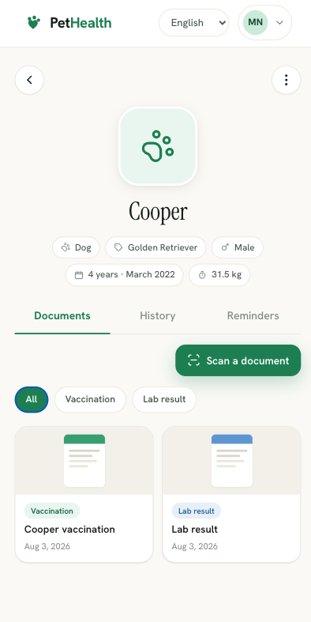
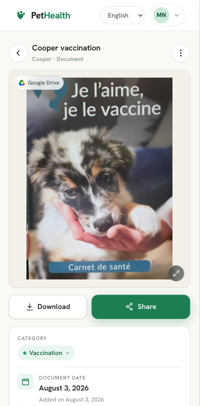
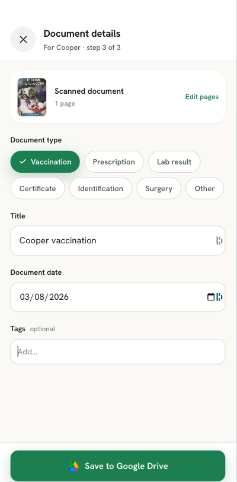
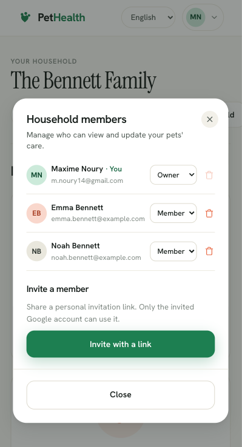
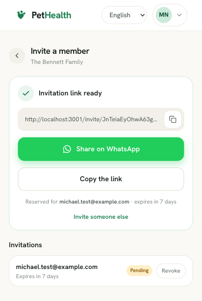
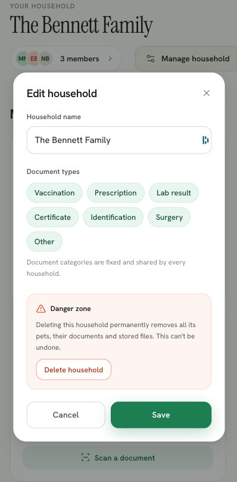
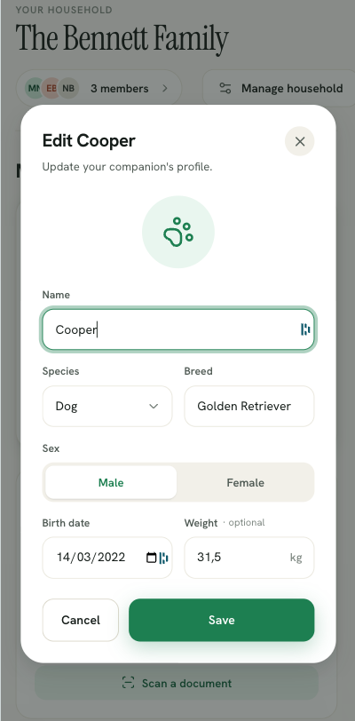
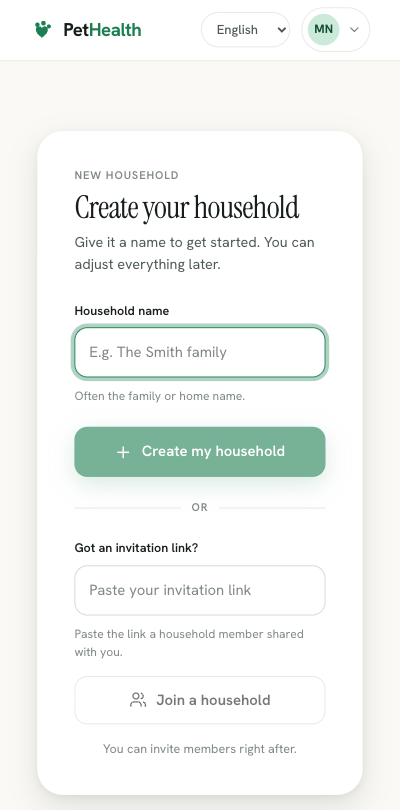

# 🐾 PetHealth

**The digital health record for your pets.**

PetHealth lets you scan your pet's health documents (vaccination records,
prescriptions, lab results…) straight from the browser, store them in your
own Google Drive, and share the follow-up with the members of your household.

**➡️ Live app: [pethealthapp.app](https://pethealthapp.app)** — sign in with Google.

[](https://github.com/MaximeNry/pet-health/actions/workflows/ci.yml)

> 💼 Personal project built as a technical showcase: the focus is on
> architecture (DDD, hexagonal) as much as on the product itself.
> See [ARCHITECTURE.md](ARCHITECTURE.md) for the design decisions in detail.

| Household dashboard | Pet record | Scanned document |
|---|---|---|
|  |  |  |

<details>
<summary>More screens</summary>

| Scan — metadata | Household members | Invite a member |
|---|---|---|
|  |  |  |

| Edit household | Pet form | Create a household |
|---|---|---|
|  |  |  |

</details>

## ✨ Features

- 📸 **Document scanning** — in-browser camera capture, no native app required:
  crop, rotate and contrast adjustment before upload, multi-page documents
- ☁️ **Google Drive storage** — files stay in the user's own Drive
  (OAuth scope `drive.file`: the app can only access files it created)
- 🐕 **Pet profiles** — multiple pets per household, each with typed and
  dated documents
- 👨‍👩‍👧 **Shared household** — link-based invitations, role and member
  management so several people can track the same pets
- 🔐 **Sign in with Google** — OAuth authentication, account management and
  data deletion
- 🛡️ **Authorization layer** — a household-membership guard scopes every
  resource to its household; sensitive operations (member management,
  invitations, deletion) are owner-only
- 🌍 **Internationalized** — English and Spanish (next-intl), no hardcoded
  user-facing string
- 📱 **Installable (PWA)** — web app manifest and icons, "Add to Home Screen"
  on iOS and Android

## 🏗️ Tech stack

| Layer | Technologies |
|---|---|
| Backend | [NestJS 11](https://nestjs.com/), [Prisma 7](https://www.prisma.io/), PostgreSQL 17 |
| Frontend | [Next.js 16](https://nextjs.org/) (App Router, React Compiler), Tailwind CSS, TanStack Query |
| Monorepo | pnpm workspaces (`apps/api`, `apps/web`, `packages/shared`) |
| Dev infra | Docker Compose, `node:24-alpine` images |
| External | Google OAuth 2.0, Google Drive API |

## 📐 Architecture

The backend is a **modular monolith** split into bounded contexts
(tactical DDD), each structured as a **hexagonal architecture**
(ports & adapters):

```
apps/api/src/contexts/
├── health-document/   ← Core: health documents, DocumentStorage port (Drive)
│   ├── domain/          rich entities, value objects, ports (zero framework dependency)
│   ├── application/     use cases
│   ├── infrastructure/  Prisma & Google Drive adapters, mappers
│   └── presentation/    NestJS controllers
├── pet/               ← pet profiles
├── household/         ← household and sharing
├── invitation/        ← link-based invitations
└── user/              ← user accounts
```

Key principles:

- The `domain/` layer depends on nothing — no framework, no Prisma. Adapters
  are swappable (Drive could be replaced by S3 without touching the domain).
- No cross-context imports: contexts communicate by identifier only.
- The frontend follows the **Feature-Sliced Design** methodology.

➡️ The full reasoning (subdomains, context map, conventions) is documented
in [ARCHITECTURE.md](ARCHITECTURE.md).

## 🚀 Getting started

### Prerequisites

- **Node.js 24+** and pnpm (via `corepack enable pnpm`)
- **Docker** with Docker Compose
- A **Google OAuth client** ([Google Cloud Console](https://console.cloud.google.com/apis/credentials))
  with the Google Drive API enabled

### Run the project

```bash
# 1. Clone and install dependencies
git clone https://github.com/MaximeNry/pet-health.git
cd pet-health
pnpm install

# 2. Configure the environment
cp .env.example .env
# → fill in GOOGLE_CLIENT_ID and GOOGLE_CLIENT_SECRET

# 3. Start everything (PostgreSQL + API + Web)
docker compose up --build
```

- Frontend: http://localhost:3001
- API: http://localhost:3000

### Useful commands

```bash
pnpm --filter api start:dev                  # API only (outside Docker)
pnpm --filter web dev                        # Frontend only
pnpm --filter api exec prisma migrate dev    # Database migration
pnpm --filter api exec prisma generate       # (Re)generate the Prisma client
```

> ℹ️ The Prisma CLI runs on the host and expects `localhost:5432` in
> `DATABASE_URL`, while the API inside the container uses `postgres:5432`.

## 🧪 Tests

```bash
pnpm --filter api test        # 18 suites, 123 tests
pnpm --filter api test:cov    # with coverage
```

Every push and pull request runs the same checks in GitHub Actions
([`ci.yml`](.github/workflows/ci.yml)): lint, Prettier, `tsc --noEmit`, the unit
tests with coverage, the production builds of both apps, and a database job that
replays the migrations on a real PostgreSQL 17 and fails if `schema.prisma` has
drifted from them. CodeQL and Dependabot run alongside.

```bash
pnpm lint          # ESLint on both apps, warnings included
pnpm typecheck     # tsc --noEmit on both apps
pnpm format:check  # Prettier, check only
```

Testing follows the dependency rule: because `domain/` depends on nothing,
entities and value objects are tested as plain TypeScript — no database, no
NestJS test module, no mocking framework. Use cases are covered by injecting
in-memory fakes into their ports, which is exactly what ports and adapters buy
you. Examples:

- [`health-document.entity.spec.ts`](apps/api/src/contexts/health-document/domain/health-document.entity.spec.ts) — invariants of the aggregate root
- [`invitation.entity.spec.ts`](apps/api/src/contexts/invitation/domain/invitation.entity.spec.ts) — expiry, single use, email matching
- [`household-membership.guard.spec.ts`](apps/api/src/authorization/household-membership.guard.spec.ts) — access control rules

## 🗺️ Roadmap

- [x] Google authentication and account management
- [x] Pet profiles
- [x] Household, link-based invitations and member management
- [x] Document scanning and upload to Google Drive
- [ ] Vaccination reminders and due dates
- [ ] Consolidated health history
- [ ] PDF export of a pet's record
- [ ] OCR on scanned documents

## 📄 License

[MIT](LICENSE) © Maxime Noury
